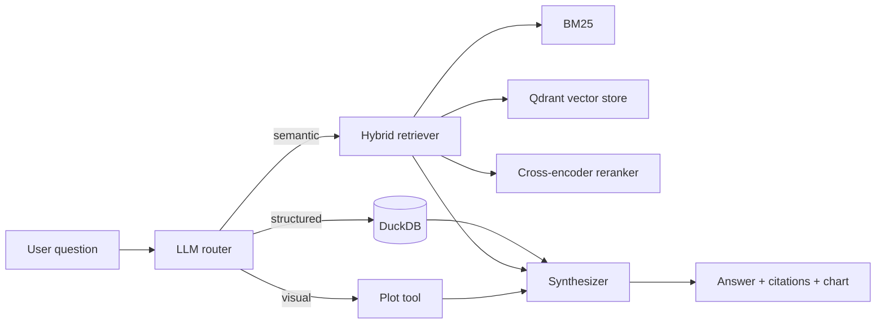

# job-application-insights

> A hybrid retrieval system over a heterogeneous corpus of job-application emails.
> Vector search + BM25 + cross-encoder reranking, fronted by an LLM agent that
> routes natural-language questions to either semantic retrieval, structured
> SQL queries, or plot generation — and synthesises a cited answer.

This project is a **learning-and-portfolio build** for modern LLM/agentic
systems. Each weekly milestone produces a working artefact and a measurable
quality improvement over the previous one.

---

## Status

- [x] **Week 0** — Repo, tooling, CI, smoke tests
- [ ] Week 1 — Ingestion + naive end-to-end RAG
- [ ] Week 2 — Hybrid retrieval (vector + BM25 + rerank) + evaluation harness
- [ ] Week 3 — Agentic router with SQL / semantic / plot tools (LangGraph)
- [ ] Week 4 — FastAPI + Streamlit + Docker + deploy + synthetic public demo

---

## Architecture (target)



---

## Tech stack

| Layer | Tool |
|---|---|
| Language | Python 3.11 |
| Dep mgmt | uv |
| Lint / format | ruff |
| Type checking | mypy (strict) |
| Tests | pytest + pytest-cov |
| Pre-commit | ruff + mypy hooks |
| CI | GitHub Actions |
| LLM | Anthropic Claude (Sonnet 4.6 + Haiku) |
| Embeddings | BGE-small-en-v1.5 (sentence-transformers) |
| Vector store | Chroma (Week 1) → Qdrant (Week 2+) |
| Sparse retrieval | BM25S |
| Reranker | bge-reranker-base |
| Orchestration | LangGraph + Pydantic-v2 |
| Structured | DuckDB |
| API | FastAPI + uvicorn |
| UI | Streamlit |
| Container | Docker (multi-stage) |
| Deploy | Fly.io (target) |
| Eval | RAGAS + custom golden-set harness |
| Observability | Arize Phoenix |

---

## Development

```bash
# Install all dependencies (incl. dev tools)
uv sync --all-extras

# Run the test suite (with coverage)
uv run pytest

# Lint
uv run ruff check src tests

# Format
uv run ruff format src tests

# Type check
uv run mypy src

# Run the CLI stub
uv run jai --version
```

A pre-commit hook is configured to run ruff and mypy on every commit:

```bash
uv run pre-commit install
```

---

## Layout

```
src/job_application_insights/
├── ingest/        # Week 1 — mbox/CSV → chunks
├── retrieval/     # Week 1-2 — dense / sparse / hybrid / rerank
├── agents/        # Week 3 — LangGraph router + tools
├── api/           # Week 4 — FastAPI app
├── cli.py         # Console entry point (jai)
└── config.py      # Pydantic settings

tests/             # pytest suite (smoke tests only in Week 0)
data/synthetic/    # Public-demo fake data (commits OK)
data/raw/          # Real email data (gitignored)
evals/             # Golden set + RAGAS runs (Week 2+)
notebooks/         # EDA + experiment scratchpads
```

---

## License

MIT
